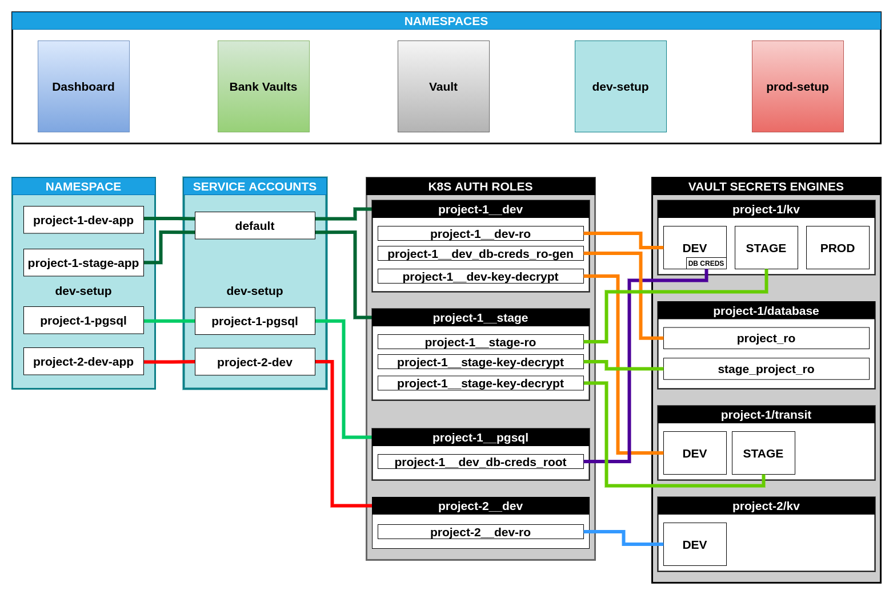
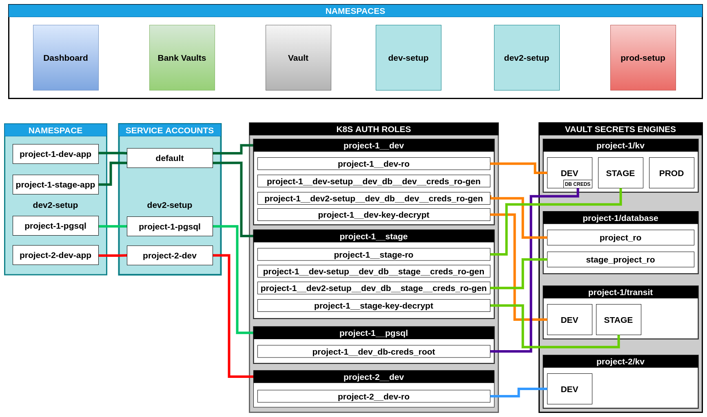
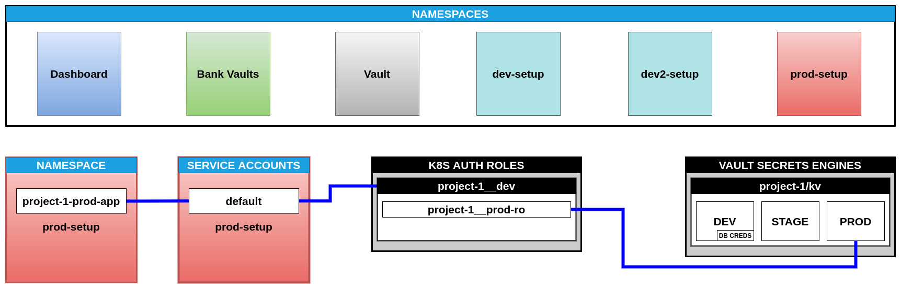

# Secrets for apps deployed into K8S

This repo is set of examples and prototypes for secrets management

## Requirements

- [minikube](https://minikube.sigs.k8s.io/docs/start/)
- [kubectl](https://kubernetes.io/docs/tasks/tools/install-kubectl/)
- [helm](https://helm.sh/docs/intro/install/)
- [docker](https://docs.docker.com/get-docker/)
- [jq](https://stedolan.github.io/jq/download/)
- curl
- 

  
make

  - linux:
    - Depends on distro
  - mac os:
    - `brew install make`
  - windows:
    <!-- TODO: check instruction :arrow_down: -->
    - [instruction](http://gnuwin32.sourceforge.net/packages/make.htm)
  

- 

  
sed

  
  - linux:
    - You are OK
  - mac os:
    - [instruction](https://medium.com/@bramblexu/install-gnu-sed-on-mac-os-and-set-it-as-default-7c17ef1b8f64)
  - windows:
    <!-- TODO: check instruction :arrow_down: -->
    - [instruction](http://gnuwin32.sourceforge.net/packages/sed.htm)
  

## Documentation

- [errors and how to fix them](docs/errors.md)
- [TODO](TODO.md)
- 

  
Demo project schemes

  
  - 

    
dev-setup

  
    
    

  - 

    
dev-setup

  
    
    

  
  - 

    
prod-setup

  
    
    

  

## Useful links

- [Mutating webhook configuration examples](https://banzaicloud.com/docs/bank-vaults/mutating-webhook/configuration/)
- [Mutating webhook annotations](https://banzaicloud.com/docs/bank-vaults/mutating-webhook/annotations/)
- [Service account issuer validation from BanzaiCloud (k8s 1.21+)](https://banzaicloud.com/blog/kubernetes-oidc/)
- [Service account issuer validation official documentation (k8s 1.21+)](https://kubernetes.io/docs/tasks/configure-pod-container/configure-service-account/#service-account-issuer-discovery)
- [chart values](https://github.com/hashicorp/vault-helm/blob/master/values.yaml)
- [sidecar injector](https://learn.hashicorp.com/tutorials/vault/kubernetes-sidecar?in=vault/kubernetes)
- [csi provider](https://learn.hashicorp.com/tutorials/vault/kubernetes-secret-store-driver?in=vault/kubernetes)
- [vault agent](https://learn.hashicorp.com/tutorials/vault/agent-kubernetes?in=vault/kubernetes)
- [vault injector examples](https://www.vaultproject.io/docs/platform/k8s/injector/examples)

## How to start

- Run `make minikube-start`
- 

  
(Optional) If you wish to download docker images before demo

  
  - Run `make prepare`
  

- 

  
(Optional) If you wish to see every container in test cluster

  
  - Run `make pods-watch`
  

- 

  
(Optional) If you wish to see cluster events

  
  - Run `make events-watch`
  

- Run `make dashboard-deploy`
- Run `make proxy`
- Run `make admin-sa-token-get`
- Open [dashboard](http://localhost:8001/api/v1/namespaces/kubernetes-dashboard/services/https:kubernetes-dashboard:/proxy/#/login)
---
- Next step: [Deploy bank vault Vault Secrets Webhook](namespaces/bank-vaults)
